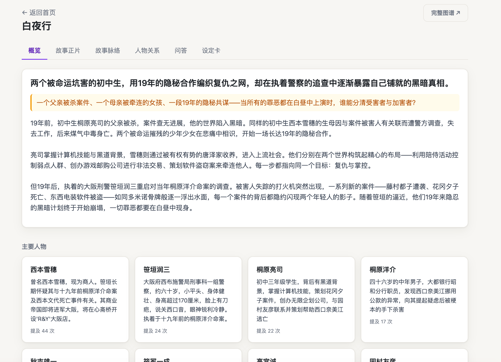
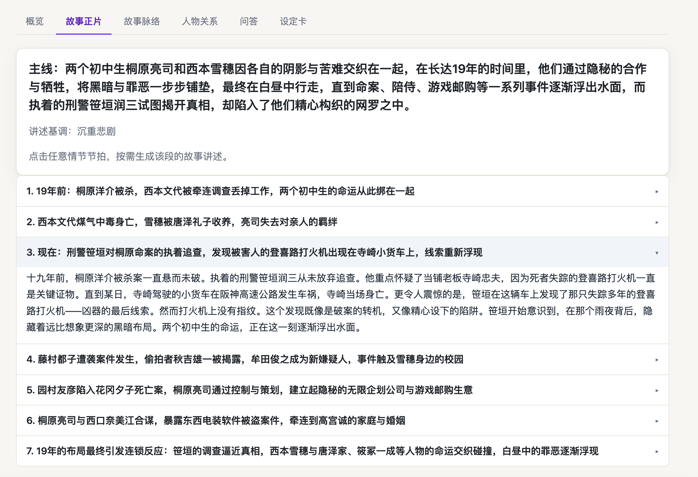
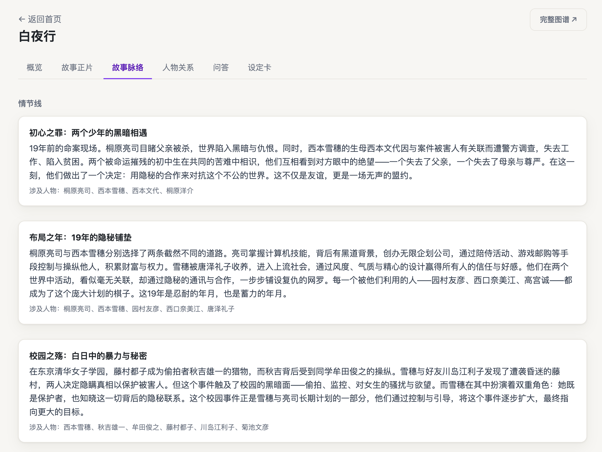
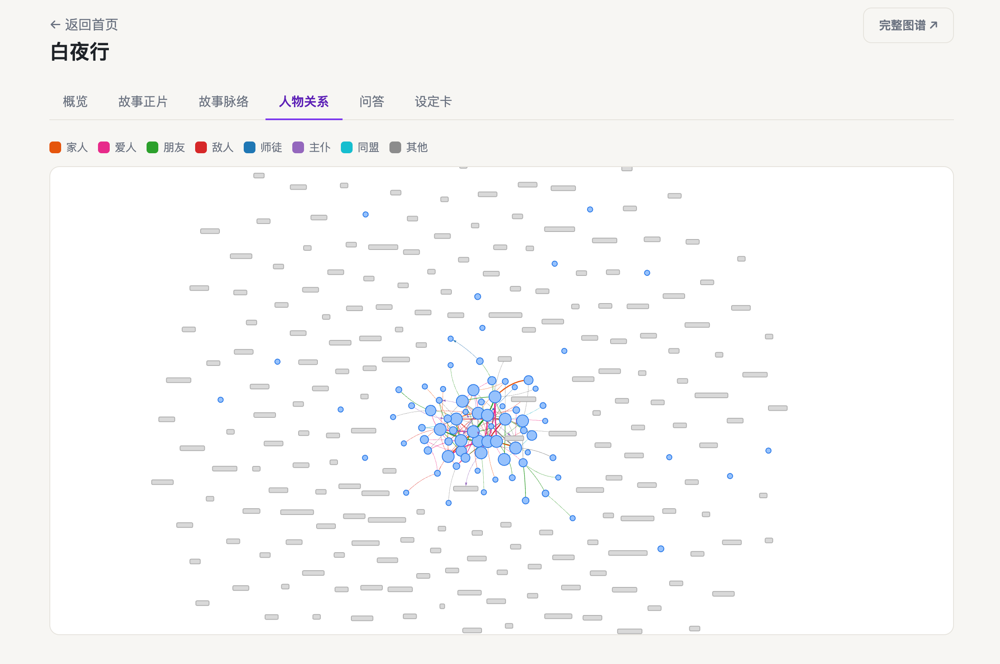
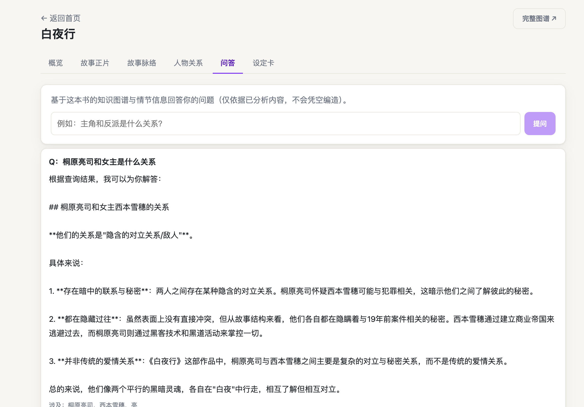
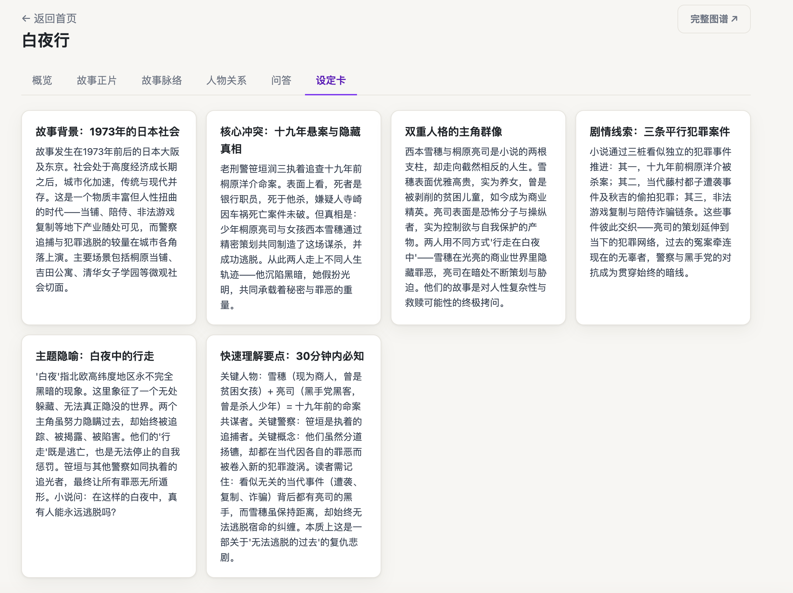
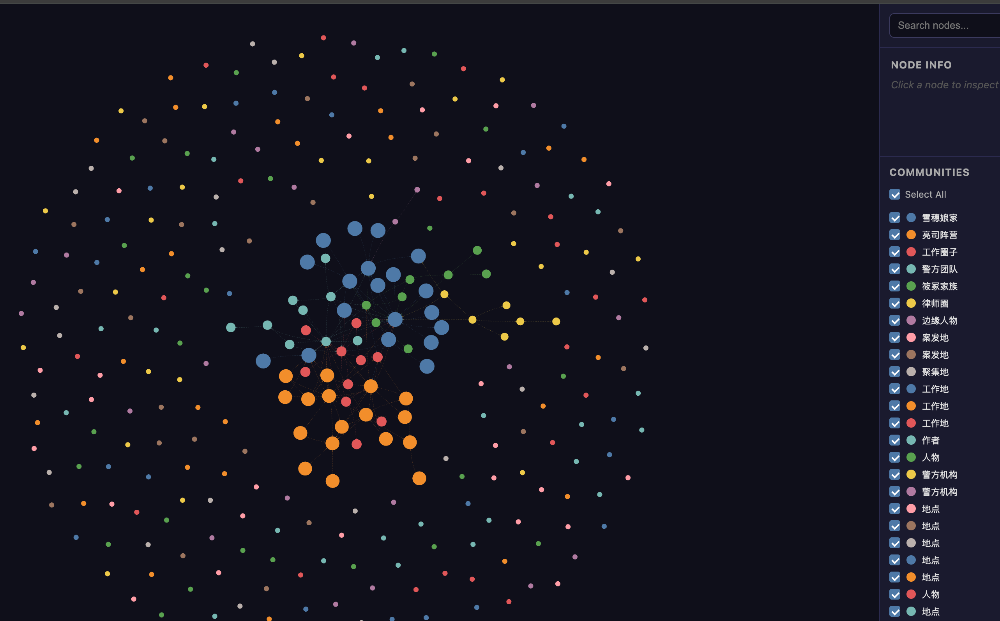

# 30分钟读懂一本书 · 小说知识图谱

上传一本小说（`.txt` / `.epub`），后台异步跑一次处理管道，自动生成：

- **分层故事摘要**：一句话 → 故事钩子 → 概述 → 情节线（arc）→ 章节
- **人物关系网图谱**：按 8 类关系着色，点节点/边查看详情
- **主题/设定卡片**
- **基于图谱的问答（Q&A）**

核心体验：让读者在几分钟内知道「这本书讲了什么」，并可按需下钻。

后端 FastAPI + AWS Strands / Bedrock，前端 React + Vite + vis-network。复用
[graphify](https://pypi.org/project/graphifyy/) 的图构建 / 聚类 / 分析内核，新增小说专属的
语义提取层与读者摘要层。

---

## 界面预览

以《白夜行》为例，读者页（`ReaderPage`）分 6 个标签页，均由处理产出的工作包驱动：

### 概览

一句话总结 + 故事钩子 + 概述 + 主要人物卡片（含提及次数）。



### 故事正片

主线梗概 + 情节节拍列表，点击任意节拍按需生成该段叙述。



### 故事脉络

情节线（arc≈图谱社区）卡片，每张列出涉及人物。



### 人物关系

vis-network 关系图，按 8 类关系着色（图例见顶部）。



### 问答

基于本书知识图谱与情节信息回答（仅依据已分析内容，不凭空编造）。



### 设定卡

主题 / 设定卡片网格：背景、核心冲突、主角群像、主题隐喻等。



### 完整图谱

graphify 导出的独立可视化页（深色主题，右侧 COMMUNITIES 按社区聚类，可搜索/筛选节点）。



---

## 架构

```
上传 .txt/.epub
  → 解析 (epub→文本, 按章节切分)
  → 分块 (每章 ~3k token, 保留章节归属)
  → 逐块提取 (Strands structured_output, 滑动上下文注入已知实体)
  → 增量合并去重 (精确名 → 别名表 → 相似名归一化确认)
  → graphify build_from_json (图在此诞生)
  → 聚类 (社区≈情节线/阵营) + 分析 (god_nodes=主角/桥接 + 建议问题)
  → 摘要 (Strands → 分层摘要 + 设定卡)
  → 打包 work package
```

进度通过轮询 `GET /api/works/{id}/status` 上报：
`queued → parsing → extracting(%) → building → summarizing → done`（失败则 `failed`）。

处理产出为静态工作包，落在 `data/works/{work_id}/`（`graph.json`、`summary.json`、
`chapters.json`、`spine.json` 等）。设计细节见
`docs/superpowers/specs/2026-07-27-novel-knowledge-graph-design.md`。

---

## 快速开始

需要 Python 3.11+ 和 Node 18+。

### 后端

```bash
cd backend
python -m venv .venv && source .venv/bin/activate
pip install -e ".[dev]"
uvicorn app.main:app --reload        # 服务在 :8000
```

无需 AWS 也可体验：设置离线模式使用确定性的本地提取/摘要（不调用 Bedrock）。

```bash
NOVEL_KG_USE_FAKE_LLM=1 uvicorn app.main:app --reload
```

真实提取走 AWS Bedrock，需要有效凭证。配置通过环境变量（前缀 `NOVEL_KG_`）或
`backend/.env`（导入时自动加载，已 gitignore）。常用项：

| 变量 | 说明 | 默认 |
| --- | --- | --- |
| `NOVEL_KG_USE_FAKE_LLM` | 离线模式（`1`/`true`）| 关闭 |
| `NOVEL_KG_BEDROCK_MODEL_ID` | Bedrock 模型 id | `us.anthropic.claude-sonnet-4-6` |
| `NOVEL_KG_BEDROCK_REGION` / `AWS_REGION` | Bedrock 区域 | `us-east-1` |
| `NOVEL_KG_DATA_ROOT` | 工作包输出目录 | `<repo>/data/works` |

### 前端

```bash
cd frontend
npm install
npm run dev                          # Vite 在 :5173, 代理 /api/* → :8000
npm run build
```

打开 http://localhost:5173 上传 `test_novel.txt`（仓库根目录自带样例）体验完整流程。

### 测试

```bash
cd backend
PYTHONPATH=. pytest -q               # 需从 backend/ 目录并设置 PYTHONPATH
```

测试使用离线模式，不需要 AWS。

---

## API 速览

无鉴权，文件系统存储。前端同源调用 `/api/*`（Vite dev 代理去掉 `/api` 前缀转发到 `:8000`）。

| 方法 | 路径 | 说明 |
| --- | --- | --- |
| `POST` | `/works` | 上传小说（multipart `file` + `granularity`=`quick`\|`complete`），返回 `work_id` |
| `GET` | `/works` | 列出所有作品 |
| `GET` | `/works/{id}/status` | 处理进度 |
| `GET` | `/works/{id}` | 获取工作包（未完成返回 409）|
| `GET` | `/works/{id}/graph` · `/graph.html` | 图谱 JSON / 可视化页 |
| `POST` | `/works/{id}/chapters/{cid}/summary` | 按需生成章节摘要（缓存优先）|
| `GET` / `POST` | `/works/{id}/beats` · `/beats/{i}/story` | 故事正片（按需叙述，缓存）|
| `GET` / `POST` | `/works/{id}/ask` | 图谱问答（缓存优先，再调 LLM）|
| `DELETE` | `/works/{id}` | 删除作品 |

提取分两档：**快速（默认）** 仅角色 + 主线关系 + 关键事件；**完整** 提取全部实体。

---

## 关系类别

8 个固定类别，前后端必须保持一致：
家人 / 爱人 / 朋友 / 敌人 / 师徒 / 主仆 / 同盟 / 其他。
仅 **师徒** 和 **主仆** 为有向关系（绘制箭头）。

---

## 目录结构

```
backend/          FastAPI 应用 + 处理管道 (Python, 包名 app)
  app/main.py       应用入口
  app/routes.py     API 路由
  app/models.py     Pydantic 数据模型 + 关系类别
  app/config.py     环境变量配置 (前缀 NOVEL_KG_)
  app/pipeline/     解析/分块/提取/合并/图谱/摘要/问答
frontend/         React 18 + Vite 5 + vis-network SPA
data/works/       每个作品的运行时产出 (gitignore)
docs/             设计文档
  screenshots/      README 界面截图
test_novel.txt    样例小说
```
